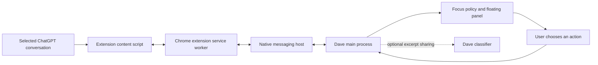

**Dave + ChatGPT integration plan — 14 September 2026**

Build a Chrome extension that connects selected conversations at [chatgpt.com](https://chatgpt.com/) to the existing Dave Mac app. Dave remains the floating focus companion; the extension supplies conversation context and returns the user to a specific chat. Start with active chats and work in progress. Scheduled tasks follow a separate adapter.

The Chrome helper is implemented in the 0.3.0 alpha. It includes excerpt preview, a native connection, mission pinning, return to an open chat, local idea saving, and draft insertion. CopilotKit accepts explicitly selected chat context and renders reviewed Ambiguous task proposals. The Ambiguous adapter reads recent tasks and creates unassigned tasks through its REST API. See [setup and verification](dave-extension/README.md).

On 14 September, live Chrome preview, connection to the packaged app, and return to the correct tab passed. Authenticated Ambiguous task creation and retrieval also passed. The 0.3.1 build adds Featherless provider selection and visible failure feedback. With the approved dedicated key and explicit non-thinking requests, the packaged app passed a live response, task cancellation, edited proposal approval, task creation, and retrieval. See [hackathon readiness](DAVE_HACKATHON_READINESS.md). The remaining sections describe the architecture and later milestones.

**CopilotKit and Ambiguous AI**

CopilotKit remains Dave's interactive assistant: Ask Dave, mission proposals, selected conversation context, and reviewed task cards. Its tool result records the Ambiguous task ID only after successful creation. Dave's main process executes the action and keeps credentials out of the extension and renderer. [CopilotKit generative UI](https://docs.copilotkit.ai/concepts/generative-ui-overview).

Ambiguous supplies durable workspace tasks. The implemented adapter uses the task list and create operations from its [OpenAPI specification](https://app.ambiguous.ai/api/openapi.json). Creating a task sends the reviewed title and description and leaves it unassigned. Calendar imports, agent assignment, task completion controls, and event notifications can follow. A task record does not prove that a coworker has started working on it.

**First usable experience**

1. Open a conversation in Chrome and click the Dave extension's **Connect this chat** action.
2. Preview the excerpt Dave will receive. Choose **Use as my mission** or **Watch this chat**.
3. Dave shows the chat title, the chosen next action, the observed response state, and when it last received an update.
4. Switch to another chat or app. Dave retains the pinned destination and applies its existing focus policy.
5. Choose **Return to chat**, **Save for later**, or **Draft a follow-up**. A later release adds **Stop response** after its behavior is verified.

The first acceptance scenario uses two ordinary chats: pin dashboard work, switch to unrelated research, then return to the exact dashboard tab with one click. Save a useful side idea with its source link and restore it after restarting Dave. Reading and returning must work with Dave's model connection disabled.

**What each feature can establish**

| Feature | Implementation | Limit shown to the user |
| --- | --- | --- |
| Read the connected chat | Extract rendered message text from that conversation's page. | “Recent loaded messages”; history absent from the page is unavailable. |
| Identify the destination | Pair Chrome profile instance, tab, document, and verified conversation URL. | A new or temporary chat may have no durable return link. |
| Observe a response | Interpret supported page controls and changes in the latest assistant message. | “Responding”, “Response ended”, “Needs attention”, or “Unknown”; an ended response does not prove the user's work is complete. |
| Return to work | Activate the matched existing tab; offer its saved URL if the tab closed. | Reopening may require sign-in or the correct workspace. |
| Draft a follow-up | Show editable text in Dave and insert it into the matching composer on request. | Preserve any existing composer draft; sending is a separate user action. |
| Stop a response | Invoke the identified Stop control, then verify the response state. | This interrupts generation. Continuing requires another prompt; resumable execution is a separate capability. |
| Pause Dave | Stop collecting excerpts and making classification calls. | ChatGPT can continue working independently. |
| Scheduled tasks | Later: read the Scheduled interface and support specific verified controls. | This review did not establish a scheduled-task management API. |

ChatGPT documents both scheduled work and controls for long-running goals. Those product features need individual adapters; a generic Stop button cannot represent all of them. [Scheduled tasks](https://learn.chatgpt.com/docs/automations), [long-running work](https://learn.chatgpt.com/docs/long-running-work).

**Architecture**

Create `dave-extension/` beside `dave-app/`. Use Manifest V3, TypeScript, an isolated content script, a service worker, and a small connection popup. Content scripts can inspect page DOM while keeping their JavaScript environment separate from the page. Treat DOM text as untrusted input. [Chrome content scripts](https://developer.chrome.com/docs/extensions/develop/concepts/content-scripts).

Use Chrome Native Messaging between the extension service worker and a bundled host process. Chrome launches that host and exchanges length-prefixed JSON over stdin/stdout. Register the exact extension ID in `allowed_origins`; content scripts reach the host through the service worker. [Native messaging](https://developer.chrome.com/docs/extensions/develop/concepts/native-messaging).

Add a separate `DaveChromeBridge` executable. The existing Swift observer uses newline-delimited JSON and cannot accept Chrome's framing unchanged. The bridge connects to Dave through a local Unix socket restricted to the current user, with an installation token and protocol handshake. Keep this channel separate from Dave's CopilotKit HTTP endpoint. The bridge accepts typed context and action messages, with no arbitrary shell execution or file access operations.

Dave's **Connect Chrome** setup installs the native-host manifest in Chrome's user directory and points it at the installed bridge. Repair the path after an app move or update; uninstall removes only Dave's registration. Package the bridge with the app and sign it during release packaging. Development and store extensions need explicit, separate allowed IDs.

**Access and context**

Begin with `activeTab`, `scripting`, `storage`, and `nativeMessaging`. `activeTab` grants access following an extension invocation and has a limited lifetime. The first version reconnects through the toolbar when access expires. Later, **Keep watching connected chats** may request optional access to `https://chatgpt.com/*`, while Dave still collects only conversations the user selected. [Chrome activeTab](https://developer.chrome.com/docs/extensions/develop/concepts/activeTab), [permission declarations](https://developer.chrome.com/docs/extensions/develop/concepts/declare-permissions).

Apply these collection rules before sending context to Dave:

- Read only the selected conversation's rendered messages. Exclude sidebar history, composer drafts, account details, attachments, and unrelated panels.
- Start with the latest six messages and a total excerpt cap of 12,000 characters. Mark truncated or partial context. Do not scroll through history automatically.
- Disable collection in incognito and recognizable Temporary Chats. Unsupported layouts or uncertain conversation identity produce no excerpt.
- On route, workspace, account, or document changes, invalidate pending context and actions. When identity cannot be verified, require reconnecting that chat.
- Keep excerpts in memory. Persist the user's mission, saved ideas, and selected chat references. Sending excerpts to Dave's model requires a distinct setting that explains the additional data shared; existing title-only AI consent does not cover conversation text.
- Pause or disconnect stops observers, clears queued excerpts, and invalidates pending model responses. The classifier may suggest relevance; conversation text cannot authorize a browser action.

Observe mutations within the verified conversation container, debounce updates, and send only changed bounded snapshots. Each snapshot carries `protocolVersion`, `profileInstanceId`, `tabId`, `documentId`, `conversationKey`, `revision`, `observedAt`, `coverage`, message roles/text, and available actions. Chrome tab IDs alone are insufficient across restarts or profiles.

Persist connection preferences outside service-worker globals. Reconnect with backoff and resynchronize from a fresh snapshot. Background throttling, discarded tabs, browser restarts, and bridge failure produce **Stale** or **Disconnected** states. Never announce completion because updates stopped. Chrome can terminate and restart extension service workers. [Worker lifecycle](https://developer.chrome.com/docs/extensions/develop/concepts/service-workers/lifecycle).

**Actions and verification**

Keep selectors and conversation extraction inside a versioned `chatgpt` adapter. Prefer observed semantic roles, labels, and stable attributes. Do not depend on page coordinates, minified CSS names, session cookies, or undocumented network endpoints.

An action contains a request ID, connection ID, conversation revision, expiry, and a permitted operation. Re-check the actual tab, document, conversation, and control immediately before acting. Reject stale or ambiguous targets. After acting, inspect the resulting UI and report success, failure, or uncertainty. Never automatically resend a prompt after an uncertain result.

Ship Return and Save first. For draft insertion, check whether the composer already contains text and offer an explicit merge or replacement preview. Start with submission from ChatGPT itself. Add sending from Dave only after the UI displays the exact destination and text and the user clicks Send. Stop response needs its own observed acknowledgement. Pausing several sessions remains outside this release.

**Build sequence**

| Step | Deliverable | Acceptance evidence |
| --- | --- | --- |
| 1. Test the live page | A capability report and sanitized fixtures for ordinary chats, streaming, navigation, and errors. | Distinguish two chats and extract their latest messages; record unsupported modes. Test Projects, custom GPTs, research, and Scheduled separately. |
| 2. Connect Chrome to Dave | Extension shell, native bridge, setup/repair screen, versioned messages. | Round trip from Chrome to the packaged app; reject an unpaired client and malformed messages. Recover from Dave and Chrome restarts. |
| 3. Read and pin | Excerpt preview, connection controls, chat identity, mission draft, and Return. | Complete the two-chat acceptance scenario. No data from an unconnected chat enters Dave's state. |
| 4. Use context for focus | Bounded excerpts feed the existing scheduler after opt-in. | A delayed response about chat A cannot classify chat B; pause and disconnect abort pending collection and model work. |
| 5. Add individual actions | Save, draft insertion, then verified Stop response. | Preserve drafts, reject switched targets, handle duplicate requests, and show uncertain outcomes without retrying a submission. |
| 6. Prepare distribution | Packaged Mac bridge, extension bundle, setup instructions, compatibility record. | Install on a second Mac and Chrome profile, update both components, revoke access, and uninstall the bridge registration. |

Replay DOM fixtures in automated tests and run a short live smoke test before each extension release. Include partial history, message edits/regeneration, multiple tabs with identical titles, changed locale/layout, prompt-injection text, account switching, and stale background tabs. Release read-only features if mutation controls cannot be verified consistently. Chrome Web Store submission and public Mac distribution follow their respective packaging checks.

**Later: native ChatGPT and richer task control**

The installed `/Applications/ChatGPT.app` is version `26.908.40834`, bundle ID `com.openai.codex`, with Codex CLI `0.154.0-alpha.6.2`. Its bundled scripting dictionary declares generic Chromium commands, with no ChatGPT-specific conversation or task API. This inspection establishes the installed package, not its automation behavior.

OpenAI's App Server documents thread listing/reading, streamed status, steering, and interruption. First test whether a documented connection reaches the desktop's existing server and selected threads. A separately launched server does not establish ownership of work running elsewhere. Generate schemas for the installed version and keep unsupported operations disabled. The documented WebSocket transport is experimental. [App Server](https://learn.chatgpt.com/docs/app-server).

A Dave plugin could report selected work through MCP tools and lifecycle hooks. Hooks expose events such as prompt submission, Stop, and Interrupt, but Stop means a turn ended. ChatGPT Work and Codex support lifecycle hooks where the execution environment has the scripts and the user has trusted them. Validate this separately from ordinary Chat mode. [Plugin architecture](https://developers.openai.com/plugins/concepts/plugins), [hooks](https://learn.chatgpt.com/docs/hooks).

For native conversations without a supported provider connection, test a bounded Accessibility reader after the browser milestone. Screen reading does not establish task status or resumable control. Do not copy private application databases, extract login tokens, or treat tools available inside this development conversation as Dave's public API.

The next implementation starts with the Chrome capability test and native messaging connection. The first integration requires successful extraction and exact-tab recovery; task controls depend on their own observed behavior.
