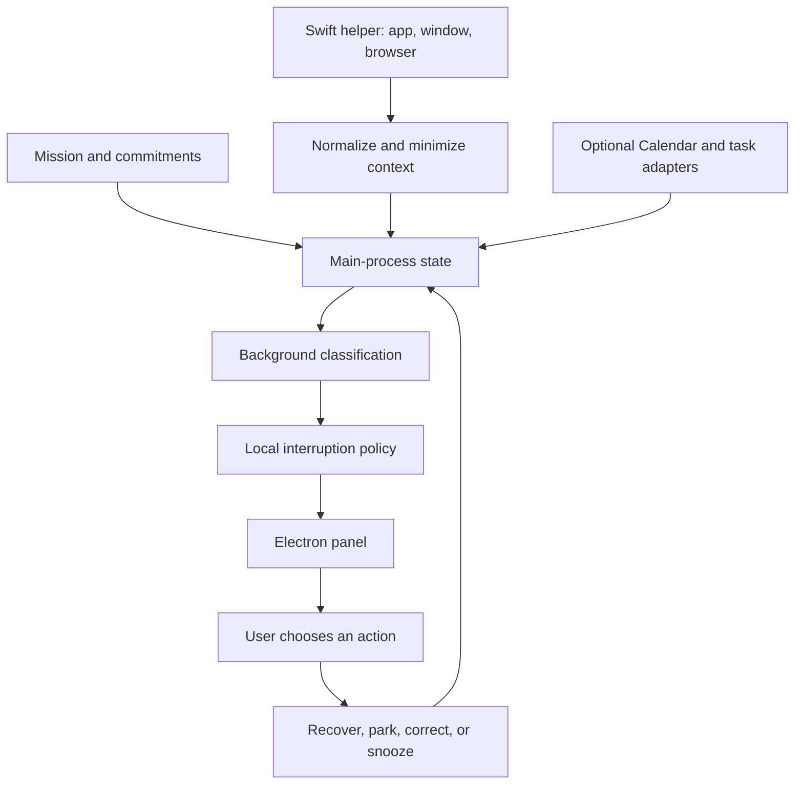

**Dave macOS build plan — 13 September 2026**

Build v1 from the existing Electron application, as agreed. Dave should help someone finish the work they chose, while keeping their other commitments visible. The first release must complete a real cycle: declare a mission, notice a detour, explain it, and return to the relevant work or save the side idea.

14 September follow-up: use a Chrome extension helper for the first ChatGPT conversation integration. The [ChatGPT integration plan](DAVE_CHATGPT_INTEGRATION_PLAN.md) specifies the browser connection, context limits, task actions, and later native-app support.

Planning defaults: macOS 14 or later, Apple Silicon first, a directly downloadable app, local storage, and a user-supplied model API key. These are implementation assumptions; Intel support and managed model billing can follow evidence of demand.

**Evidence and current state**

Reviewed [GitHub main at 9180b83](https://github.com/YardSecurityExpert/dave/tree/9180b839860aad2ddb42025ee1492390d4b1eaeb), which matches this checkout. Reviewed the [two-minute demo](https://www.loom.com/share/6d221f20fdcf4f3fb8f6f96c6c1e2e2c) through frames sampled across the checked-in MP4 and a local transcription of the complete audio. The recording lasts 120.157 seconds.

The video establishes these requirements:

| Approximate point | What happens | Product requirement |
| --- | --- | --- |
| 00:13–00:35 | Joe has several coding tasks; Caroline needs dashboard findings for a customer call. | Record a chosen priority, the next action, and its deadline. Activity can be useful work while still distracting from the current mission. |
| 00:38–00:50 | Theresa invites Joe to padel at 16:00. | Connect a personal commitment with the time available for work. |
| 00:50–01:09 | Blue Dave panel explains the 15:30 departure and offers a return to the dashboard or an afternoon plan. | Give a concrete reason and an actionable destination; retain the blue mascot and compact panel. |
| 01:09–01:35 | Joe returns to the investigation; other sessions are shown as locked or paused. | Restore a specific task. Session protection requires a supported integration and an explicit user choice. |
| 01:35–02:00 | Joe can leave for padel. | Measure whether the intervention helped finish the intended work. |

The Electron code already contains mission entry, app/title/browser observation, a CopilotKit runtime, model classification, an interruption policy, recovery, local idea parking, and corrections. The [repository README](https://github.com/YardSecurityExpert/dave/blob/9180b839860aad2ddb42025ee1492390d4b1eaeb/README.md) describes its live and deterministic demo modes.

The separate local `attention-bunny-macos` prototype provides the video's native popup and polls a demo server. It is untracked here and has no general activity engine. Use its appearance and window behavior as reference material. The browser scenario supplies simulated messages, calls, completed investigations, and task locking.

On 13 September, `npm run verify` completed: TypeScript reported no errors, all 10 unit tests succeeded, the production build completed, and the deterministic HTTP integration test succeeded. This does not verify live model classification, macOS permissions, or recovery on a user's computer.

**Architecture**

Keep Electron, TypeScript, React, Zod, and CopilotKit. Move continuous operation into the main process. The renderer displays state and submits user choices. A bundled Swift helper supplies native observation and, later, Calendar and Reminders access.

| Area | Implementation choice |
| --- | --- |
| Application shell | Existing tray application; separate popover and interruption views; settings window. |
| Observation | Persistent signed Swift helper, structured messages over inherited stdin/stdout, bounded requests, restart handling. Use `NSWorkspace` for the frontmost app, Accessibility for its focused window, and browser-specific Automation adapters for active tabs. |
| Background engine | Main-process scheduler with one classification in flight; independent of chat visibility, window lifetime, and renderer timers. |
| AI boundary | A dedicated classifier returns validated data and evidence references. It has no recovery or integration tools. Keep CopilotKit for Ask Dave, mission drafting, and interactive explanations. |
| Actions | Main-process handlers execute a recorded user choice against an unexpired intervention. Reuse handlers from both buttons and confirmed chat actions. |
| Persistence | Versioned local JSON for missions, commitments, parked ideas, settings, and cooldowns. Keep atomic writes; add validation and recovery from corrupt files. Raw observation history stays in memory by default. |
| Credentials | Settings-based key entry, encrypted through Electron `safeStorage`, with ciphertext on disk. On macOS, its encryption keys use Keychain. [Electron storage documentation](https://www.electronjs.org/docs/latest/api/safe-storage). |
| Delivery | Packaged app and signed Swift helper; Developer ID signing, hardened runtime, notarization, and a downloadable DMG. [Electron signing documentation](https://www.electronjs.org/docs/latest/tutorial/code-signing). |

Retain the current JXA watcher behind an adapter during the native-helper transition. The packaged-app permission experiment decides the helper packaging and prompt ownership before the rest of the watcher depends on them. Apple's [NSWorkspace documentation](https://developer.apple.com/documentation/appkit/nsworkspace) supplies frontmost-app information and activation notifications.

**Contracts that prevent incorrect interruptions**

Each activity observation needs an ID, mission revision, observation time, app bundle ID, window identity, browser/tab identity where available, title, URL, permission status, and active dwell. Keep the original navigation URL locally for recovery; send a minimized version to the classifier.

Every classification request captures an immutable context snapshot. Its response carries the request ID, mission revision, activity identity, class, confidence, and reason. Reject responses after a mission change, pause, or relevant context change. A response about one page must never classify a newly opened page.

Track a distraction episode from its start until a return to work, a new mission, or a meaningful context change. Start evaluation with 90 seconds of active dwell and a ten-minute cooldown. The existing confidence threshold of 0.7 is a tuning input, not a calibrated probability. Validate it on labeled examples before enabling automatic interruptions. Emit one intervention per episode and persist cooldown across restart.

Expire outdated interventions and cancel pending work on pause. Uncertain classifications, missing permissions, idle periods, screen lock, and model failures produce no distraction nudge. Electron exposes idle, lock, and sleep signals through [powerMonitor](https://www.electronjs.org/docs/latest/api/power-monitor).

Keep drift detection and deadline reminders separate. A deadline can approach while Joe is doing relevant work. Deadline arithmetic uses recorded times and user-entered task/travel allowances; the model can explain the result. An unknown deadline remains absent.

Store corrections per mission and specific page/task by default. Let the user deliberately broaden a correction to a domain or app. Correcting one research video must not silently exempt every future video.

**Build sequence**

1. **Establish the packaged foundation.** Add `services`, `adapters`, and `storage` boundaries under `dave-app/src/main`; move lifecycle code out of `index.ts`. Introduce versioned domain types in `src/shared/types.ts` and separate mission, activity, commitment, intervention, and recovery records. Add a repeatable packaging command and stable app identity. Upgrade Electron from the current 33.x dependency to a supported release after checking compatibility; Electron supports its latest three stable majors. Verify signing and permissions in a minimal packaged app with the helper. [Electron release policy](https://www.electronjs.org/docs/latest/tutorial/electron-timelines).

   Completion: the app launches without Node or a development server, saves a mission, and preserves identity and data across an update. Permission denial is represented as a capability state.

2. **Make observation accurate.** Implement app activation events, focused-window lookup, and bounded browser polling while a supported browser is foreground. Ship Chrome and Safari first; test Brave, Edge, and Arc individually before enabling their adapters. Firefox and unsupported apps retain title-level context. Add idle/lock/sleep handling, exclusions, Pause for 15 minutes, Pause for today, Resume, and Complete mission. Missing or malformed URLs must not crash the watcher.

   Completion: a replay distinguishes two unrelated tasks in the same app when title/URL data allows it. Active dwell stops during inactivity and resets appropriately after wake. Pause stops observation and new model requests.

3. **Move classification into the background.** Replace the interval in `renderer/hooks/AgentChat.tsx` with `main/services/classifier.ts` and `scheduler.ts`. Debounce changes, coalesce requests, and apply a minimum interval of 30 seconds; use a 60-second refresh only while context needs reassessment. Cache by mission revision and context identity, with expiry. Add timeout, cancellation, bounded retries, token accounting, and a configurable daily request cap. Clear irrelevant chat history and exclude old parked ideas from classification payloads.

   Completion: classification continues with the popover hidden and cannot mislabel a page after a delayed response. Missing keys, offline operation, malformed model responses, and rate limits leave the mission and manual actions usable.

4. **Complete the recovery interaction.** Present the interruption directly from main-process policy; remove the extra model round trip that currently opens it and chooses the continuation. Use the video's blue Dave identity from `docs/dave.png` and `docs/landing.css`, replacing the Electron app's current clay palette and rabbit imagery. Offer Return to work, Save for later, This belongs to my mission, and Snooze/dismiss. Keyboard focus stays with the user's app until they interact with the nudge; support Escape, VoiceOver, reduced motion, multiple displays, and full-screen spaces.

   Capture a recovery checkpoint when work is on track or explicitly pinned. Prefer activating its existing app/window/tab; fall back to one known URL in the recorded browser when its adapter supports that. Show the next action if restoration fails. Saving an idea retains its title, optional URL, note, and chosen revisit time; add open, edit, complete, and delete controls. Execute each intervention choice once, even after double-clicks or retries. Show success only after the action finishes. Remove the unsupported “Ambiguous sync pending” claim.

   Completion: each of the three core choices works with the model disconnected after classification. Restart preserves saved ideas and corrections. Recovery avoids opening the current implementation's collection of up to three historical URLs.

5. **Add the commitment-aware afternoon.** First support manual commitments: “padel at 16:00, leave at 15:30,” a work deadline, and user-provided remaining effort. Show the afternoon plan from those records. Then add selected Apple calendars through EventKit and optionally export a parked idea to Reminders. Calendar reading requires full access at the OS level, even if Dave's own behavior only reads events. Request Calendar and Reminders permissions separately when enabling each feature, with their current usage-description keys. Preserve manual commitments when access is denied. Handle edited/cancelled events, time zones, and daylight-saving changes. [Apple EventKit access guidance](https://developer.apple.com/documentation/technotes/tn3152-migrating-to-the-latest-calendar-access-levels).

   Completion: the padel scenario works from real stored commitments and a real work destination. Departure warnings use the entered travel allowance. The calendar adapter processes only selected calendars and a bounded upcoming time window.

6. **Verify and distribute a beta.** Keep the existing deterministic demo and policy tests; add scenario replays for delayed classification, same-domain context changes, idle dwell, pause/resume, snooze, repeated intervention events, and migration from today's `state.json`. Exercise all actions in the packaged macOS app and run a consented live-model session. Test denied/revoked permissions, empty browser windows, app crashes, renderer restarts, multiple monitors, offline use, sleep/wake, and expired deadlines. Verify installation and update on a second Mac. Offer start-at-login as a setting. Add signed update delivery after the first downloadable build is validated.

   Completion: a user installs the DMG, sets a mission, receives one justified nudge during a controlled detour, returns to the intended work, saves an idea across restart, corrects a false positive, pauses Dave, and completes the mission.

**Data handling and process boundaries**

Apply app/domain exclusions before retaining titles or making model calls. Do not collect screenshots, keystrokes, clipboard contents, or page bodies for this version. Exclude private browser contexts where an adapter can identify them; if it cannot reliably distinguish them, require explicit enablement for that browser and describe the limit. Minimize URL credentials, query parameters, and fragments before transmission, preserving only explicitly permitted task identifiers. Treat titles, URLs, and imported event text as untrusted data.

Keep the observation trail in a bounded in-memory buffer, initially 30 events. Persist only intentional records and recovery checkpoints; add Clear history and Reset Dave. Offer a short, explicit diagnostic recording mode for troubleshooting. Pause cannot retract data already sent, so cancel in-flight work and discard late responses as well as stopping new collection.

Protect any retained loopback CopilotKit endpoint with an unpredictable per-launch credential, sender/origin validation, and bounded inputs; use a dynamically assigned port. The preload exposes only typed commands. Validate renderer IPC senders. Bind an action to its intervention ID and known destination; the model must not supply an arbitrary application or navigation target. Keep existing renderer sandboxing, context isolation, and navigation restrictions. [Electron security guidance](https://www.electronjs.org/docs/latest/tutorial/security).

**Following the full video beyond the beta**

| Capability | Next implementation | Evidence required before enabling it |
| --- | --- | --- |
| “Your investigation is ready” | A task adapter with stable task IDs, status events, and return links. | A documented provider API or a user-installed integration that reports completion. A window title alone cannot establish completion. |
| Priorities from messages | Start with pasted text or a share action; later add an explicit Slack or task-system connection. | Working account authorization, selected scope, and a reviewable mission draft. The demo's notifications are simulated. |
| Pause or lock other sessions | Optional protection mode for connected tasks, with visible duration and Resume. | A supported pause/resume operation with provider acknowledgement. Arbitrary third-party sessions cannot be locked by changing Dave's UI. |
| Rich browser context | An opt-in browser extension for tab identity, private-window exclusion, and narrowly scoped page excerpts. | Demonstrated improvement on cases that titles and URLs cannot distinguish. |
| Travel estimates | An optional routing integration tied to a chosen destination. | A verified route response and timestamp. Keep the entered departure time available. |

Tools available inside this Codex conversation are not an API that can be bundled into Dave. Investigate provider support before promising integration with coding sessions. Mission completion, task completion, parking an idea, and pausing a running agent remain separate actions.

**Release decision**

The first milestone is one installed app completing the real mission → detour → explanation → recovery loop with manual commitments. Calendar support completes the commitment-aware beta. Task status and session protection follow their integration experiments.

Evaluate classification with at least 50 labeled mission/activity pairs, including useful research, a different work project, and actual detours. Target at least 90% precision for cases that would interrupt; report missed interruptions separately. Keep automatic nudges disabled for an adapter/model combination that misses that target. During a five-workday pilot, record user-rated usefulness, false nudges, successful returns, dismissals, and model requests without uploading raw activity. Measure CPU, memory, and battery impact on a named Mac; require zero model requests while paused or locked and investigate sustained idle CPU use above 1%.

The remaining external prerequisites are a Developer ID identity for distribution, credentials for a consented live-model check, and test machines for the claimed macOS/browser support. Model cost and API reliability will be measured from the pilot; the current repository's automated checks do not establish either.
