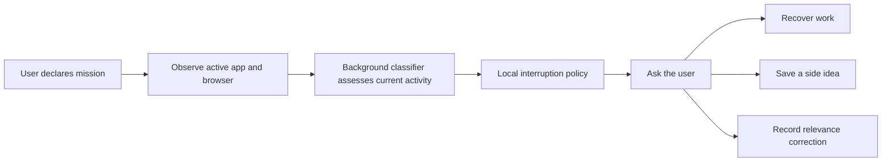
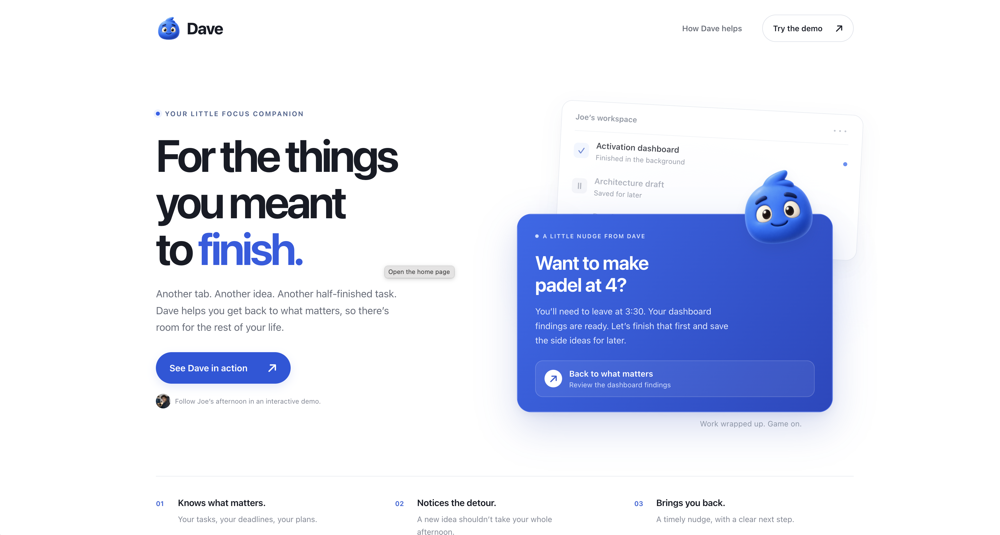

# Dave App

[**Download Mac alpha + Chrome helper**](https://github.com/YardSecurityExpert/dave/releases/tag/v0.3.1-alpha.1) · [**Setup instructions**](https://github.com/YardSecurityExpert/dave/releases/download/v0.3.1-alpha.1/SETUP.md)

Apple Silicon (M1 or newer), macOS 14+. This alpha is not notarized; see setup instructions before opening. Bring your own model-provider and Ambiguous API keys.

Built for #AgentsEverywhere.

A macOS menu bar agent prototype for keeping a mission in focus. When attention drifts, Dave offers three choices: return to your work, park the idea, or mark the activity as relevant.

With activity access enabled, the desktop supplies the active app, window title, supported browser URL, and a user-declared mission. A dedicated background classifier can assess that context through OpenAI or Featherless. A local policy checks dwell time, confidence, corrections, and cooldown before showing an intervention. CopilotKit supports Ask Dave and mission drafting.

## Core workflow



| Component | Implementation |
| --- | --- |
| Activity context | [Swift helper](dave-app/native/DaveHelper.swift) and [native adapter](dave-app/src/main/adapters/native.ts) |
| Agent | [Background classifier](dave-app/src/main/services/classifier.ts) and [CopilotKit chat runtime](dave-app/src/main/runtime.ts) |
| Interruption policy | [Confidence, dwell, cooldown, and correction checks](dave-app/src/main/policy.ts) |
| User control | [Focus and interruption interface](dave-app/src/renderer/App.tsx) |
| Actions | [Focus service](dave-app/src/main/services/focus.ts), with [Electron IPC](dave-app/src/main/index.ts) and [local persistence](dave-app/src/main/storage/state.ts) |

See the [app README](dave-app/README.md) for alpha verification and remaining work. [Judging evidence](VERIFICATION.md) records the original demo checks.



## Website

[Meet Dave](https://thedave.app/) · [Interactive demo](https://thedave.app/demo.html)

Cloudflare Pages hosts the landing page from `docs/`; see [hosting notes](DAVE_WEBSITE_HOSTING.md). The hosted demo shows Dave’s reminder in the browser.

## Demo video

[Watch on Loom](https://www.loom.com/share/6d221f20fdcf4f3fb8f6f96c6c1e2e2c) or [download the MP4](docs/dave-demo.mp4).

## Try the demo

Requires macOS, Node.js 22.12 or newer, and Apple Command Line Tools.

```sh
cd dave-app
npm ci
npm run demo
```

Select **Preview a gentle nudge** to trigger the interrupt. Demo mode uses a seeded mission and deterministic AG-UI events through CopilotKit. It requires no credentials, makes no model calls, and does not monitor your activity.

## Code

- [`dave-app/src/main/`](dave-app/src/main/): Electron lifecycle, activity watcher, drift policy, runtime, and demo agent.
- [`dave-app/src/preload/`](dave-app/src/preload/): typed IPC bridge.
- [`dave-app/src/renderer/`](dave-app/src/renderer/): React interface, CopilotKit tools, and interrupt UI.
- [`dave-app/design/`](dave-app/design/): the app's design tokens and styles.

See the [app README](dave-app/README.md) for configuration, privacy details, and implementation limits.

## Checks

```sh
cd dave-app
npm run verify
```

## Status

The 0.3.1 alpha's TypeScript check, production build, and 44 automated tests succeeded. The tests cover policy, storage, extension behavior, Featherless streaming and tool review, provider errors, Ambiguous request handling, and compiled native messaging. Automated tests use simulated provider responses. Live Chrome preview, connection, return to the source tab, and Ambiguous task creation and retrieval also passed.

A dedicated Featherless key is configured. The packaged app passed a live reply and the CopilotKit task review flow: cancel without creation, edit a second proposal, approve it, and retrieve the resulting Ambiguous task. Parked ideas are stored locally. The [Chrome helper](dave-extension/README.md) connects selected ChatGPT conversations; CopilotKit supports shared context and reviewed Ambiguous task creation. Calendar and further task controls remain in the [integration plan](DAVE_CHATGPT_INTEGRATION_PLAN.md). The browser presentation uses simulated calls, messages, and investigation results.
